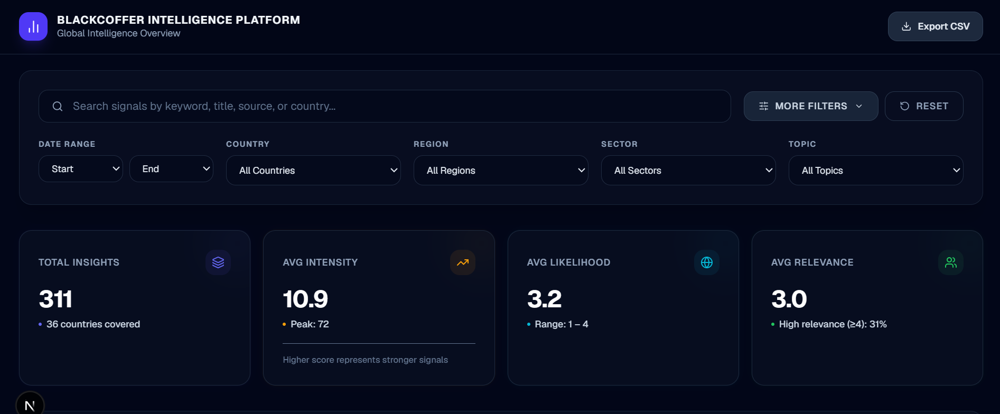
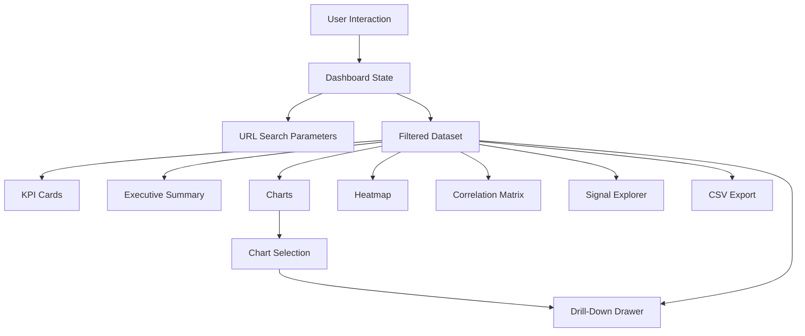
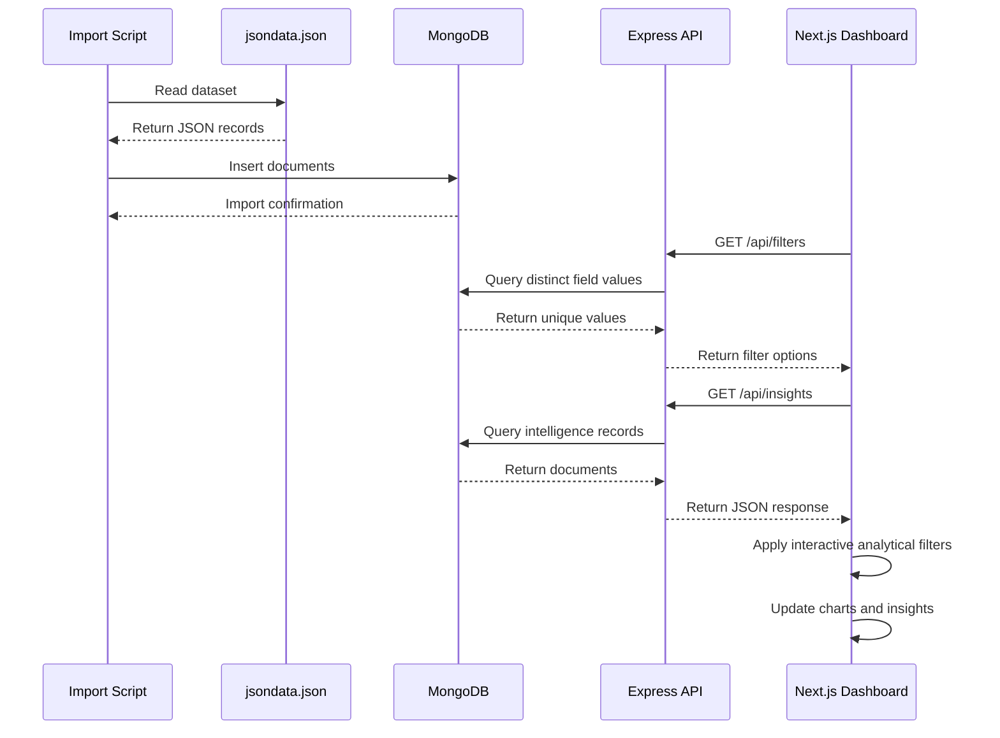

# BlackCoffer Intelligence & Visualization Platform

A production-oriented, full-stack Business Intelligence and Data Visualization Dashboard built to transform global market intelligence data into interactive, filterable, and actionable insights.

The platform provides multidimensional data exploration through interactive charts, advanced filtering, executive summaries, correlation analysis, topic-region heatmaps, data quality monitoring, drill-down analysis, and a searchable signal explorer.

Built using Next.js, TypeScript, Tailwind CSS, Recharts, Node.js, Express.js, MongoDB, and Mongoose.

---

## Table of Contents

- [Overview](#overview)
- [Platform Interface](#platform-interface)
- [Problem Statement](#problem-statement)
- [Solution](#solution)
- [Key Features](#key-features)
- [Dashboard Analytics](#dashboard-analytics)
- [Interactive Filtering System](#interactive-filtering-system)
- [Drill-Down Analysis](#drill-down-analysis)
- [Executive Summary Engine](#executive-summary-engine)
- [Heatmap Analysis](#heatmap-analysis)
- [Correlation Analysis](#correlation-analysis)
- [Signal Explorer](#signal-explorer)
- [Data Coverage Analysis](#data-coverage-analysis)
- [System Architecture](#system-architecture)
- [Data Flow](#data-flow)
- [Backend Architecture](#backend-architecture)
- [API Documentation](#api-documentation)
- [Frontend Architecture](#frontend-architecture)
- [Project Structure](#project-structure)
- [Tech Stack](#tech-stack)
- [Installation and Setup](#installation-and-setup)
- [Environment Variables](#environment-variables)
- [Database Import](#database-import)
- [Running the Application](#running-the-application)
- [Engineering Decisions](#engineering-decisions)
- [Performance Considerations](#performance-considerations)
- [Future Improvements](#future-improvements)
- [License](#license)

---

# Overview

The BlackCoffer Intelligence & Visualization Platform is an interactive analytics dashboard designed for exploring structured market intelligence signals across multiple dimensions.

The dataset contains information such as:

- Intensity
- Likelihood
- Relevance
- Topic
- Sector
- Region
- Country
- PESTLE category
- Source
- Start year
- End year
- Impact
- Publication information

Instead of presenting the dataset as a static collection of charts, the application provides an interconnected analytical environment.

Every filter selection and supported chart interaction updates the analytical context of the dashboard. This allows users to move from a high-level global overview to a focused analysis of a particular sector, country, topic, region, or PESTLE category.

The application follows a full-stack architecture:

```text
MongoDB
    ↓
Express.js REST API
    ↓
Next.js Data Layer
    ↓
Central Dashboard State
    ↓
Filtered Analytical Dataset
    ↓
Charts + KPIs + Heatmaps + Correlation + Table + Drawer
```

---

# Platform Interface

The following screenshots demonstrate the main analytical workflows and interface components of the platform.

## 1. Main Dashboard and Key Analytics

The main dashboard provides a consolidated overview of the intelligence dataset through KPI cards and interactive visualizations.

Users can quickly understand:

- Total number of intelligence signals
- Average intensity
- Average likelihood
- Average relevance
- Geographic distribution
- Sector concentration
- Topic trends
- PESTLE distribution



---

## 2. Collapsible Filter Deck and Range Sliders

The filtering system allows users to progressively narrow the dataset across multiple dimensions.

Available filters include:

- End Year
- Topic
- Sector
- Region
- PESTLE Category
- Source
- Country
- Intensity Range
- Likelihood Range
- Relevance Range

The filter panel is collapsible so that users can maximize the visualization area after selecting their analytical context.


---

## 3. Dynamic Executive Summary

The dashboard generates an analytical summary directly from the currently filtered dataset.

The summary identifies:

- Dominant sectors
- Strongest regions
- Leading topics
- Dataset concentration
- Average analytical indicators
- Current filtered scope

Unlike a static description, the summary changes dynamically when the user changes filters or interacts with supported visualizations.


---

## 4. Topic × Region Heatmap and Correlation Matrix

The advanced analytics section provides two complementary analytical tools.

The Topic × Region Heatmap shows the concentration of intelligence signals across topic and region combinations.

The Pearson Correlation Matrix measures relationships between:

- Intensity
- Likelihood
- Relevance

This provides both categorical distribution analysis and quantitative relationship analysis.


---

## 5. Signal Explorer

The Signal Explorer provides record-level access to the intelligence dataset.

Users can:

- Browse individual records
- Sort columns
- Change rows per page
- Navigate through pages
- View analytical metrics
- Open source publications
- Inspect the records behind aggregated visualizations


---

## 6. Dynamic Drill-Down Analysis Drawer

Clicking supported chart elements opens a contextual slide-out analysis drawer.

The drawer provides detailed statistics for the selected subset without navigating away from the dashboard.

It includes:

- Signal count
- Average intensity
- Average likelihood
- Average relevance
- Distribution information
- Recent intelligence signals
- Source-level details


---

# Problem Statement

Business intelligence datasets often contain multiple dimensions such as geography, sectors, topics, time periods, impact indicators, and source information.

A simple collection of independent charts creates several problems:

1. Charts do not communicate with one another.
2. Users cannot easily move from aggregated data to individual records.
3. Filter state is lost when the page is refreshed.
4. Analytical insights must be manually inferred from charts.
5. Relationships between numerical indicators remain hidden.
6. Data completeness is rarely visible.
7. Sharing a particular analytical view is difficult.

The objective of this project was to build a dashboard that behaves as an integrated analytical system rather than a collection of disconnected visualizations.

---

# Solution

The platform introduces a centralized analytical state that connects:

- Filter controls
- URL search parameters
- KPI cards
- Charts
- Executive summary
- Heatmap
- Correlation matrix
- Signal explorer
- Drill-down drawer
- CSV export

The core interaction model is:

```text
User Interaction
        ↓
Dashboard State Update
        ↓
URL State Synchronization
        ↓
Filtered Dataset Recalculation
        ↓
All Analytical Components Update
```

This architecture ensures that every component represents the same analytical context.

---

# Key Features

## Interactive Cross-Filtering

Supported chart interactions can modify the dashboard's analytical context.

Users can interact with visual elements representing:

- Country
- Region
- Sector
- Topic
- Year
- PESTLE category

The selected dimension is propagated through the dashboard so that related analytical components update consistently.

---

## Multi-Dimensional Filtering

The dashboard supports filtering across multiple dataset dimensions simultaneously.

Example:

```text
Sector: Energy
Country: India
Region: Southern Asia
PESTLE: Economic
Topic: Oil
```

The resulting dataset becomes the shared input for:

```text
KPI Cards
Executive Summary
Charts
Heatmap
Correlation Matrix
Signal Explorer
Drill-Down Analysis
CSV Export
```

---

## URL State Synchronization

Filter selections are synchronized with URL search parameters.

Example:

```text
/?sector=Energy&country=India&region=Southern%20Asia
```

This enables:

- Bookmarkable analytical states
- Shareable filtered dashboard views
- State restoration after refresh
- Better debugging of filter combinations
- Reproducible analysis

---

## Dynamic KPI Cards

The dashboard calculates key metrics from the active filtered dataset.

Metrics include:

- Total Signals
- Average Intensity
- Average Likelihood
- Average Relevance

These values automatically recalculate whenever the analytical context changes.

---

## Interactive Visualizations

The dashboard contains multiple chart types to support different analytical questions.

These include:

- Area charts
- Scatter plots
- Pie charts
- Vertical bar charts
- Horizontal bar charts
- Topic × Region heatmap
- Pearson correlation matrix

Each visualization is selected according to the type of relationship being analyzed.

---

## CSV Export

Users can export the currently filtered dataset as a CSV file.

The exported dataset represents the active analytical state rather than always exporting the complete database.

Example workflow:

```text
Select Region
        ↓
Select Sector
        ↓
Adjust Metric Range
        ↓
Review Visualizations
        ↓
Export Filtered Dataset
```

---

# Dashboard Analytics

The dashboard supports several categories of analysis.

## Geographic Analysis

Users can analyze signals by:

- Country
- Region

This helps identify geographic concentrations and differences in intelligence signal distribution.

---

## Sector Analysis

Sector-level visualizations allow users to compare intelligence activity across industries such as:

- Energy
- Retail
- Manufacturing
- Financial Services
- Healthcare
- Technology

The exact available sectors are generated dynamically from the database.

---

## Topic Analysis

Topic analysis identifies frequently occurring intelligence themes within the active dataset.

The results change dynamically according to selected filters.

For example:

```text
All Data
    ↓
Filter: Energy Sector
    ↓
Topic distribution recalculated
    ↓
Top energy-related themes displayed
```

---

## PESTLE Analysis

Signals can be analyzed according to the PESTLE framework:

- Political
- Economic
- Social
- Technological
- Legal
- Environmental

This allows the dashboard to provide a strategic external-environment perspective.

---

# Interactive Filtering System

The filtering system is one of the core architectural components of the application.

A centralized dashboard state stores the current filter configuration.

Conceptually:

```text
filters = {
    end_year,
    topic,
    sector,
    region,
    pestle,
    source,
    country,
    intensityRange,
    likelihoodRange,
    relevanceRange
}
```

Whenever the filter state changes:

```text
Filter Input
    ↓
Update State
    ↓
Update URL
    ↓
Recalculate Filtered Dataset
    ↓
Re-render Dependent Components
```

The filtered dataset is memoized to prevent unnecessary recalculation during unrelated renders.

---

# Drill-Down Analysis

Aggregated charts are useful for identifying patterns, but analysts often need to inspect the records behind those patterns.

The drill-down drawer solves this problem.

When a supported chart element is selected:

```text
Chart Element Click
        ↓
Selected Analytical Dimension
        ↓
Matching Dataset Subset
        ↓
Calculate Subset Statistics
        ↓
Open Detail Drawer
```

The drawer displays:

- Number of matching signals
- Average intensity
- Average likelihood
- Average relevance
- Distribution statistics
- Recent intelligence records
- Publication source information

This allows users to move from:

```text
Overview → Pattern → Segment → Individual Signal
```

without leaving the dashboard.

---

# Executive Summary Engine

The Executive Summary component converts the active dataset into a readable analytical brief.

It calculates:

- Dataset size
- Dominant sector
- Sector concentration percentage
- Strongest region
- Leading topics
- Average analytical indicators
- Current analytical scope

Example calculation:

```text
Energy Signals = 80
Total Filtered Signals = 200

Sector Concentration
= (80 / 200) × 100
= 40%
```

The summary is deterministic and generated directly from the active dataset.

This ensures that the written insights remain synchronized with the visualizations.

---

# Heatmap Analysis

The Topic × Region Heatmap is used to identify concentrations between categorical dimensions.

For every topic-region pair:

```text
Cell Value = Number of Signals
             matching Topic X
             and Region Y
```

Example conceptual matrix:

| Topic | Asia | Europe | North America |
|---|---:|---:|---:|
| Oil | 18 | 12 | 24 |
| Gas | 14 | 9 | 21 |
| Market | 22 | 17 | 30 |
| Economy | 11 | 19 | 16 |

Higher signal counts are represented using stronger visual intensity.

This makes it easier to identify:

- Topic clusters
- Regional concentration
- Underrepresented combinations
- Dominant intelligence themes

---

# Correlation Analysis

The platform calculates Pearson correlation coefficients between:

- Intensity
- Likelihood
- Relevance

The Pearson correlation coefficient is defined as:

```text
r = Σ((x - x̄)(y - ȳ))
    ---------------------
    √Σ(x - x̄)² Σ(y - ȳ)²
```

The resulting value ranges between:

```text
-1 ≤ r ≤ 1
```

Interpretation:

| Value | Interpretation |
|---|---|
| `1.0` | Perfect positive correlation |
| `0.7 to 0.9` | Strong positive correlation |
| `0.3 to 0.7` | Moderate positive correlation |
| `-0.3 to 0.3` | Weak or limited linear relationship |
| `-0.7 to -0.3` | Moderate negative correlation |
| `-1.0` | Perfect negative correlation |

The matrix is recalculated when the filtered dataset changes.

Therefore, users can compare relationships such as:

```text
Global Correlation
vs
Energy Sector Correlation
vs
India-Specific Correlation
```

---

# Signal Explorer

The Signal Explorer connects aggregated analytics with record-level evidence.

Features include:

- Paginated data browsing
- Configurable rows per page
- Column sorting
- Metric badges
- Source links
- Dataset-aware updates
- Filter integration

Available row counts:

```text
10 | 25 | 50
```

The table updates automatically when the dashboard filters change.

This ensures that users see only records relevant to the current analytical context.

---

# Data Coverage Analysis

Real-world datasets often contain incomplete values.

The Data Coverage Analyst calculates field completeness for important dimensions.

Tracked fields include:

- Country
- Region
- Sector
- Topic
- End Year
- Impact

The completeness formula is:

```text
Coverage Percentage
=
(Number of Non-Empty Values / Total Records) × 100
```

Example:

```text
Records with Country = 250
Total Records = 311

Country Coverage
= (250 / 311) × 100
≈ 80.39%
```

This allows analysts to understand the reliability and completeness of the dataset before drawing conclusions.

---

# System Architecture

The application follows a client-server architecture.

```text
┌─────────────────────────────────────┐
│             USER BROWSER            │
│                                     │
│  Filters                            │
│  Charts                             │
│  KPI Cards                          │
│  Executive Summary                  │
│  Heatmap                            │
│  Correlation Matrix                 │
│  Signal Explorer                    │
│  Drill-Down Drawer                  │
└─────────────────┬───────────────────┘
                  │
                  │ HTTP / REST
                  ▼
┌─────────────────────────────────────┐
│           EXPRESS API SERVER        │
│                                     │
│  GET /                              │
│  GET /api/filters                   │
│  GET /api/insights                  │
│                                     │
│  Query Processing                   │
│  Database Communication             │
│  Response Formatting                │
└─────────────────┬───────────────────┘
                  │
                  │ Mongoose
                  ▼
┌─────────────────────────────────────┐
│             MONGODB                 │
│                                     │
│       Intelligence Documents        │
└─────────────────────────────────────┘
```

---

# Data Flow

## Component Communication Architecture



---

## Database Import and API Flow



---

# Backend Architecture

The backend is implemented using Node.js and Express.js.

Its responsibilities include:

- Connecting to MongoDB
- Serving intelligence records
- Generating dynamic filter options
- Supporting query parameter filtering
- Returning structured JSON responses
- Handling database errors
- Providing API health information

The backend communicates with MongoDB through Mongoose.

Conceptual request lifecycle:

```text
HTTP Request
      ↓
Express Route
      ↓
Query Parameter Extraction
      ↓
MongoDB Query Construction
      ↓
Mongoose Query
      ↓
Database Result
      ↓
JSON Response
```

---

# API Documentation

## Base URL

For local development:

```text
http://localhost:5000
```

---

## 1. Health Check

### Request

```http
GET /
```

### Example Response

```json
{
  "message": "BlackCoffer Dashboard API is running"
}
```

### Purpose

Used to verify that:

- Express server is running
- Application routes are available
- Backend deployment is reachable

---

## 2. Get Filter Options

### Request

```http
GET /api/filters
```

### Description

Returns distinct values from the database for supported filter dimensions.

This avoids hardcoding dropdown values in the frontend.

### Example Response

```json
{
  "success": true,
  "data": {
    "end_year": [
      "2018",
      "2020",
      "2022",
      "2025"
    ],
    "topic": [
      "gas",
      "oil",
      "market",
      "gdp"
    ],
    "sector": [
      "Energy",
      "Retail",
      "Manufacturing"
    ],
    "region": [
      "Northern America",
      "Central America",
      "Eastern Asia"
    ],
    "pestle": [
      "Economic",
      "Political",
      "Technological"
    ],
    "source": [
      "EIA",
      "OPEC",
      "World Bank"
    ],
    "country": [
      "United States of America",
      "India",
      "China"
    ]
  }
}
```

---

## 3. Get Intelligence Signals

### Request

```http
GET /api/insights
```

### Description

Returns intelligence records from MongoDB.

The endpoint supports optional query parameters for database-side filtering.

### Supported Query Parameters

| Parameter | Description | Example |
|---|---|---|
| `end_year` | Filter by end year | `2025` |
| `topic` | Filter by topic | `oil` |
| `sector` | Filter by sector | `Energy` |
| `region` | Filter by region | `Southern Asia` |
| `pestle` | Filter by PESTLE category | `Economic` |
| `source` | Filter by source | `EIA` |
| `country` | Filter by country | `India` |

### Example Request

```http
GET /api/insights?sector=Energy&country=India
```

### Example Response

```json
{
  "success": true,
  "count": 311,
  "data": [
    {
      "_id": "64b1f486d38e21a2212bb450",
      "intensity": 6,
      "likelihood": 3,
      "relevance": 2,
      "end_year": "2018",
      "country": "United States of America",
      "topic": "gas",
      "sector": "Energy",
      "region": "Northern America",
      "pestle": "Economic",
      "source": "EIA",
      "title": "US shale gas production to expand rapidly by 2018.",
      "url": "https://example.com/shale-gas"
    }
  ]
}
```

---

# Frontend Architecture

The frontend is built using Next.js with the App Router architecture.

The dashboard uses a centralized state-driven design.

Conceptually:

```text
Dashboard
│
├── Header
│
├── Filter Panel
│
├── KPI Cards
│
├── Executive Summary
│
├── Analytics Charts
│   ├── Country Analysis
│   ├── Sector Analysis
│   ├── Topic Analysis
│   ├── PESTLE Analysis
│   └── Trend Analysis
│
├── Topic × Region Heatmap
│
├── Correlation Matrix
│
├── Data Coverage Analysis
│
├── Signal Explorer
│
└── Detail Drawer
```

The primary analytical pattern is:

```text
Raw API Data
      ↓
Filter State
      ↓
Memoized Filter Operation
      ↓
filteredData
      ↓
Shared Across Components
```

This prevents each chart from independently implementing filtering logic.

---

# Project Structure

A simplified project structure is shown below.

```text
blackcoffer-dashboard/
│
├── client/
│   │
│   ├── app/
│   │   ├── page.tsx
│   │   ├── layout.tsx
│   │   └── globals.css
│   │
│   ├── components/
│   │   ├── Dashboard.tsx
│   │   ├── Filters.tsx
│   │   ├── StatCards.tsx
│   │   ├── ExecutiveSummary.tsx
│   │   ├── SignalExplorer.tsx
│   │   ├── DetailDrawer.tsx
│   │   ├── Heatmap.tsx
│   │   ├── CorrelationMatrix.tsx
│   │   └── charts/
│   │
│   ├── lib/
│   │   ├── api.ts
│   │   └── utils.ts
│   │
│   ├── public/
│   ├── package.json
│   └── .env.local
│
├── server/
│   │
│   ├── config/
│   │   └── db.js
│   │
│   ├── models/
│   │   └── Insight.js
│   │
│   ├── routes/
│   │   └── insights.js
│   │
│   ├── scripts/
│   │   └── importData.js
│   │
│   ├── data/
│   │   └── jsondata.json
│   │
│   ├── server.js
│   ├── package.json
│   └── .env
│
├── images/
│   ├── image.png
│   ├── image copy.png
│   ├── image copy 2.png
│   ├── image copy 3.png
│   ├── image copy 4.png
│   └── image copy 5.png
│
├── .gitignore
├── LICENSE
└── README.md
```

> The exact component organization may vary depending on the current implementation, but the application follows this general separation between UI, analytical logic, API communication, server routes, database models, and import utilities.

---

# Tech Stack

## Frontend

| Technology | Purpose |
|---|---|
| Next.js | Application framework |
| React | Component-based UI |
| TypeScript | Type safety |
| Tailwind CSS v4 | Styling and responsive design |
| Recharts | Interactive data visualization |
| Lucide React | Icon system |

---

## Backend

| Technology | Purpose |
|---|---|
| Node.js | JavaScript runtime |
| Express.js | REST API server |
| Mongoose | MongoDB object modeling |
| CORS | Cross-origin request handling |
| Dotenv | Environment variable management |

---

## Database

| Technology | Purpose |
|---|---|
| MongoDB | Document database |
| MongoDB Atlas | Cloud database hosting |
| Mongoose | Schema and query abstraction |

---

# Installation and Setup

## Prerequisites

Ensure that the following are installed:

```text
Node.js >= 18
npm
Git
MongoDB or MongoDB Atlas account
```

Verify Node.js:

```bash
node --version
```

Verify npm:

```bash
npm --version
```

---

## 1. Clone the Repository

```bash
git clone https://github.com/Tanmay24-ya/Visualization_Dashboard.git
```

Navigate to the project:

```bash
cd Visualization_Dashboard
```

---

# Environment Variables

The project requires separate environment files for the frontend and backend.

## Backend Environment

Create:

```text
server/.env
```

Add:

```env
PORT=5000
MONGODB_URI=mongodb+srv://<username>:<password>@<cluster-url>/blackcoffer?retryWrites=true&w=majority
```

Do not commit `.env` files to version control.

---

## Frontend Environment

Create:

```text
client/.env.local
```

Add:

```env
NEXT_PUBLIC_API_URL=http://localhost:5000
```

For production deployment, replace the local API URL with the deployed backend URL.

---

# Database Import

The raw JSON dataset must be imported into MongoDB before starting the application.

Navigate to the server directory:

```bash
cd server
```

Install dependencies:

```bash
npm install
```

Place the dataset at:

```text
server/data/jsondata.json
```

Run the import script:

```bash
npm run import
```

The import process follows:

```text
jsondata.json
       ↓
Node.js Import Script
       ↓
JSON Parsing
       ↓
Mongoose Model Validation
       ↓
MongoDB Collection
```

After a successful import, the API can query the stored intelligence records.

---

# Running the Application

The frontend and backend should run in separate terminal windows.

## Terminal 1 — Backend

```bash
cd server
npm install
npm run start
```

The backend will be available at:

```text
http://localhost:5000
```

Test the server:

```text
GET http://localhost:5000/
```

---

## Terminal 2 — Frontend

```bash
cd client
npm install
npm run dev
```

The frontend will be available at:

```text
http://localhost:3000
```

Open the application in the browser and verify that the dashboard successfully loads data from the API.

---

# Engineering Decisions

## Why Centralized Filter State?

All analytical components need to represent the same subset of data.

Without centralized state:

```text
Chart A → Filter Logic A
Chart B → Filter Logic B
Table → Filter Logic C
Summary → Filter Logic D
```

This creates duplicated logic and synchronization problems.

The platform instead uses:

```text
One Filter State
        ↓
One Filtered Dataset
        ↓
All Components
```

This improves consistency and maintainability.

---

## Why URL-Synchronized Filters?

A dashboard state stored only in React memory disappears after refresh.

URL synchronization provides:

- Persistent analytical state
- Shareable filtered views
- Bookmark support
- Reproducible analysis
- Easier debugging

---

## Why Combine Charts and a Data Table?

Charts provide aggregated patterns.

Tables provide evidence.

The combination enables:

```text
Visual Pattern
      ↓
Filter
      ↓
Drill Down
      ↓
Inspect Records
      ↓
Open Original Source
```

This is more useful for intelligence analysis than charts alone.

---

## Why MongoDB?

The intelligence dataset is naturally document-oriented and contains fields that may be missing or inconsistent across records.

MongoDB provides:

- Flexible document structure
- Natural JSON compatibility
- Easy ingestion of existing datasets
- Distinct-value queries for filters
- Flexible query construction
- Horizontal scalability options

---

# Performance Considerations

The application uses several strategies to keep dashboard interactions responsive.

## Memoized Filtering

Filtered datasets and derived analytical calculations can be memoized so that expensive transformations are not repeated unnecessarily.

Conceptually:

```text
Raw Data + Filter State
          ↓
        useMemo
          ↓
     Filtered Data
```

---

## Derived Data Reuse

Instead of filtering the raw dataset separately inside every visualization:

```text
Raw Data
   ↓
Single Filter Operation
   ↓
Filtered Dataset
   ↓
All Visual Components
```

This reduces duplicated computation.

---

## Dynamic Filter Loading

Filter options are fetched from the backend instead of being hardcoded.

This ensures that the UI remains consistent with the actual database contents.

---

## Component Separation

Analytical features are divided into specialized components.

This improves:

- Maintainability
- Debugging
- Reusability
- Testing
- Future scalability

---

# Future Improvements

The current platform can be extended with several production-grade capabilities:

- Server-side aggregation pipelines
- Redis caching for frequently requested analytics
- Authentication and role-based access control
- Saved dashboard views
- User-specific dashboards
- Automated PDF intelligence reports
- Scheduled CSV exports
- Real-time data ingestion
- WebSocket-based live updates
- Elasticsearch-powered full-text search
- Advanced anomaly detection
- AI-generated intelligence summaries
- Forecasting models
- Geographic map visualization
- Unit and integration testing
- Docker-based deployment
- CI/CD pipeline
- API rate limiting
- Request validation
- Observability and structured logging

---

# Potential Production Architecture

For larger datasets, the architecture can evolve into:

```text
                    ┌──────────────────┐
                    │     Next.js      │
                    │    Frontend      │
                    └────────┬─────────┘
                             │
                             ▼
                    ┌──────────────────┐
                    │   API Gateway    │
                    └────────┬─────────┘
                             │
                             ▼
                    ┌──────────────────┐
                    │  Express API     │
                    └───────┬──────────┘
                            │
                ┌───────────┴───────────┐
                ▼                       ▼
        ┌───────────────┐       ┌───────────────┐
        │     Redis     │       │    MongoDB    │
        │     Cache     │       │     Atlas     │
        └───────────────┘       └───────────────┘
```

This architecture would allow the platform to support larger datasets and higher request volumes.

---

# What This Project Demonstrates

This project demonstrates practical implementation of:

- Full-stack application development
- REST API design
- MongoDB integration
- Data visualization
- Interactive dashboard architecture
- Cross-component state synchronization
- URL state management
- Statistical analysis
- Correlation computation
- Data quality analysis
- Responsive interface development
- Record-level drill-down workflows
- Data export functionality
- Modular frontend architecture

The project goes beyond static visualization by connecting analytical state, visual components, statistical calculations, and record-level exploration into a single interactive intelligence platform.

---

# License

This project is distributed under the MIT License.

See the `LICENSE` file for more information.

---

# Author

Developed by Tanmay Dixit.

If you found this project useful, consider giving the repository a star.