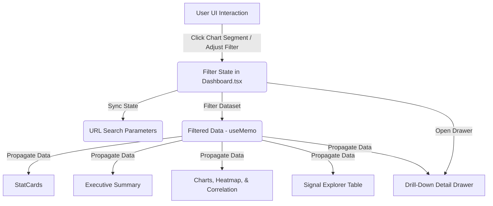
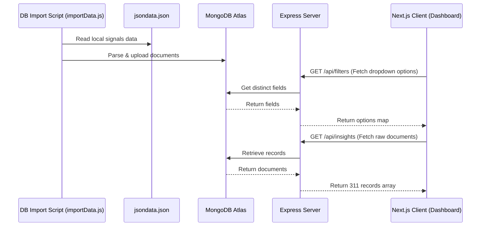

# BlackCoffer Intelligence & Visualization Platform

A production-ready, interactive Business Intelligence (BI) Dashboard designed to analyze, filter, and visualize global market intelligence signals. Powered by **Next.js (App Router)**, **Tailwind CSS v4**, **Node.js (Express)**, and **MongoDB**, this platform features real-time cross-chart filtering, URL state synchronization, a Pearson correlation matrix, a Topic × Region heatmap, and a side-draw detail panel.

---

## 📸 Platform Interface

Below are screenshots demonstrating the premium glassmorphic user interface, interactive components, and analytical features:

### 1. Main Dashboard & Key Analytics


### 2. Collapsible Filters Deck & Sliders


### 3. Key Insights (Executive Summary)


### 4. Topic × Region Heatmap & Correlation Matrix


### 5. Signal Explorer (SaaS Data Table)


### 6. Dynamic Slide-Out Drill-Down Analysis Drawer


---

## 🚀 Key Features

*   **Interactive Cross-Filtering:** Click on any bar, area point, scatter bubble, or pie slice to instantly filter the entire dashboard by that country, sector, region, topic, year, or PESTLE category.
*   **Drill-Down Detail Drawer:** Clicking a chart element opens a glassmorphic right-hand detail drawer showing key stats (signal count, average intensity, likelihood, relevance), distributions, and recent source signal cards for that specific subset.
*   **URL State Synchronization:** All filter choices are mirrored in the URL search params (`/ ?sector=Energy&country=India`). Share bookmarkable links that instantly load the dashboard in the exact same filtered state.
*   **Topic × Region Heatmap:** A visual density matrix correlating the top topics against regions, highlighting signal concentrations with customized gradient intensities.
*   **Pearson Correlation Matrix:** Automatically calculates Pearson correlation coefficients on the fly between Intensity, Likelihood, and Relevance on the filtered dataset.
*   **Dynamic Executive Summary:** Generates structured intelligence briefs containing sector concentration percentages, regional signal strengths, and top domain topics calculated directly from the filtered records.
*   **Signal Explorer Table:** Complete pagination, custom row counts (`10 | 25 | 50`), column sorting, inline metrics badges, and direct external links to publication sources.
*   **Data Coverage Analyst:** Tracks field completeness percentages across six key fields (Country, Region, Sector, Topic, End Year, and Impact) to assess data quality.
*   **CSV Data Export:** One-click downloads of the active filtered dataset as a `.csv` spreadsheet.

---

## ⚙️ Architecture & Data Flow

### 1. Component Communication Architecture



### 2. Database Import & API Flow



---

## 📡 API Endpoint Reference

### 1. Health Check
*   **URL:** `GET /`
*   **Response:**
    ```json
    {
      "message": "BlackCoffer Dashboard API is running"
    }
    ```

### 2. Get Filters Options
*   **URL:** `GET /api/filters`
*   **Description:** Dynamically fetches lists of distinct values present in the database to populate the UI select elements.
*   **Response:**
    ```json
    {
      "success": true,
      "data": {
        "end_year": ["2018", "2020", "2022", "2025"],
        "topic": ["gas", "oil", "market", "gdp"],
        "sector": ["Energy", "Retail", "Manufacturing"],
        "region": ["Northern America", "Central America", "Eastern Asia"],
        "pestle": ["Economic", "Political", "Technological"],
        "source": ["EIA", "OPEC", "World Bank"],
        "country": ["United States of America", "India", "China"]
      }
    }
    ```

### 3. Get Insights
*   **URL:** `GET /api/insights`
*   **Description:** Returns all documents in the insights collection. Supports optional query parameters for initial database-side pruning.
*   **Query Parameters:** `end_year`, `topic`, `sector`, `region`, `pestle`, `source`, `country`
*   **Response:**
    ```json
    {
      "success": true,
      "count": 311,
      "data": [
        {
          "_id": "64b1f486d38e21a2212bb450",
          "intensity": 6,
          "likelihood": 3,
          "relevance": 2,
          "end_year": "2018",
          "country": "United States of America",
          "topic": "gas",
          "sector": "Energy",
          "region": "Northern America",
          "pestle": "Economic",
          "source": "EIA",
          "title": "US shale gas production to expand rapidly by 2018.",
          "url": "https://example.com/shale-gas"
        }
      ]
    }
    ```

---

## 🛠️ Tech Stack

### Frontend (Client)
*   **Framework:** Next.js 15 (App Router, Client Component hydration)
*   **Styling:** Tailwind CSS v4 (Vanilla-based theme configurations)
*   **Visualizations:** Recharts (Area, Scatter, Pie, Vertical Bar, Horizontal Bar, custom HTML grid heatmaps)
*   **Icons:** Lucide React

### Backend (Server)
*   **Runtime:** Node.js (Express.js REST API)
*   **Database ORM:** Mongoose (MongoDB Atlas connection)
*   **Utilities:** CORS, Dotenv

---

## 🚀 Setup & Installation

### Prerequisites
*   Node.js (v18+)
*   MongoDB Instance (Local or Atlas URI connection string)

### 1. Clone the Repository
```bash
git clone https://github.com/Tanmay24-ya/Visualization_Dashboard.git
cd Visualization_Dashboard
```

### 2. Configure Backend Server
1. Navigate to the `server` directory:
   ```bash
   cd server
   ```
2. Install server dependencies:
   ```bash
   npm install
   ```
3. Create a `.env` file inside the `server/` directory:
   ```env
   PORT=5000
   MONGODB_URI=mongodb+srv://<username>:<password>@cluster0.example.mongodb.net/blackcoffer?retryWrites=true&w=majority
   ```
4. Place your raw dataset file `jsondata.json` inside the `server/data/` folder.
5. Run the database import script to upload documents to MongoDB:
   ```bash
   npm run import
   ```
6. Start the Express API server:
   ```bash
   npm run start
   ```
   *The API will run on `http://localhost:5000`.*

### 3. Configure Frontend Client
1. In a new terminal window, navigate to the `client` directory:
   ```bash
   cd client
   ```
2. Install client dependencies:
   ```bash
   npm install
   ```
3. Create a `.env.local` file inside the `client/` directory:
   ```env
   NEXT_PUBLIC_API_URL=http://localhost:5000
   ```
4. Start the Next.js local development server:
   ```bash
   npm run dev
   ```
   *The dashboard will run on `http://localhost:3000`.*

---

## 📄 License
Distributed under the MIT License. See `LICENSE` for more information.
